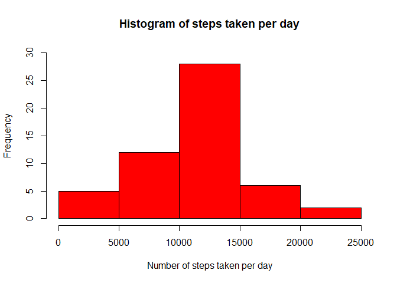
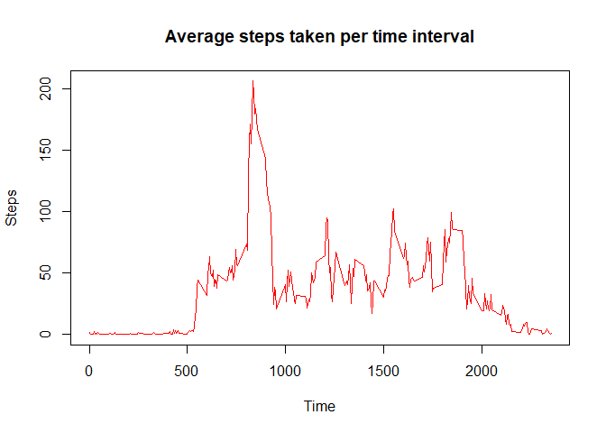
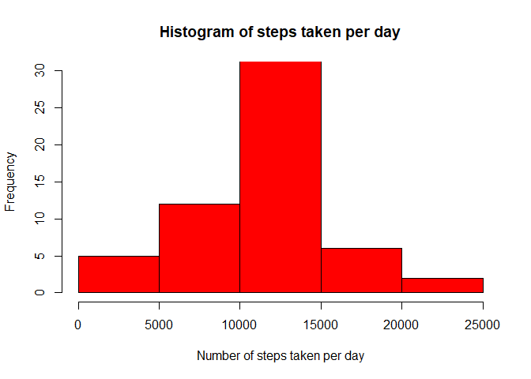
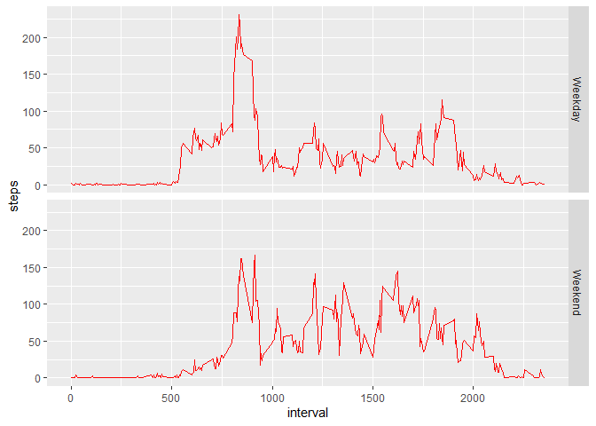

# Introduction

It is now possible to collect a large amount of data about personal movement using activity monitoring devices such as a Fitbit, Nike Fuelband, or Jawbone Up. These type of devices are part of the “quantified self” movement – a group of enthusiasts who take measurements about themselves regularly to improve their health, to find patterns in their behavior, or because they are tech geeks. But these data remain under-utilized both because the raw data are hard to obtain and there is a lack of statistical methods and software for processing and interpreting the data.  

This assignment makes use of data from a personal activity monitoring device. This device collects data at 5 minute intervals through out the day. The data consists of two months of data from an anonymous individual collected during the months of October and November, 2012 and include the number of steps taken in 5 minute intervals each day.

The data for this assignment can be downloaded from the course web site.

The variables included in this dataset are:

* **steps**: Number of steps taking in a 5-minute interval (missing values are coded as \color{red}{\verb|NA|}NA)
* **date**: The date on which the measurement was taken in YYYY-MM-DD format
* **interval**: Identifier for the 5-minute interval in which measurement was taken  

The dataset is stored in a comma-separated-value (CSV) file and there are a total of 17,568 observations in this dataset.

# Assignment

## *Loading and preprocessing the data*

Show any code that is needed to

1. Load the data (i.e. \color{red}{\verb|read.csv()|}read.csv())
2. Process/transform the data (if necessary) into a format suitable for your analysis

### Turn warnings off globally and change local language to English


```r
library(knitr)
opts_chunk$set(warning=FALSE)
Sys.setlocale("LC_TIME", "English")
```

```
## [1] "English_United States.1252"
```

### Load and process data


```r
activity <- read.csv("activity.csv")
activity$date <- as.Date(as.character(activity$date))
head(activity,n=20)
```

```
##    steps       date interval
## 1     NA 2012-10-01        0
## 2     NA 2012-10-01        5
## 3     NA 2012-10-01       10
## 4     NA 2012-10-01       15
## 5     NA 2012-10-01       20
## 6     NA 2012-10-01       25
## 7     NA 2012-10-01       30
## 8     NA 2012-10-01       35
## 9     NA 2012-10-01       40
## 10    NA 2012-10-01       45
## 11    NA 2012-10-01       50
## 12    NA 2012-10-01       55
## 13    NA 2012-10-01      100
## 14    NA 2012-10-01      105
## 15    NA 2012-10-01      110
## 16    NA 2012-10-01      115
## 17    NA 2012-10-01      120
## 18    NA 2012-10-01      125
## 19    NA 2012-10-01      130
## 20    NA 2012-10-01      135
```

## *What is mean total number of steps taken per day?*

For this part of the assignment, you can ignore the missing values in the dataset.  

1. Calculate the total number of steps taken per day
2. If you do not understand the difference between a histogram and a barplot, research the difference between them. Make a histogram of the total number of steps taken each day
3. Calculate and report the mean and median of the total number of steps taken per day

### Steps taken per day


```r
total<-aggregate(steps~date,data = activity,FUN = sum,na.rm=T)
head(total,n=20)
```

```
##          date steps
## 1  2012-10-02   126
## 2  2012-10-03 11352
## 3  2012-10-04 12116
## 4  2012-10-05 13294
## 5  2012-10-06 15420
## 6  2012-10-07 11015
## 7  2012-10-09 12811
## 8  2012-10-10  9900
## 9  2012-10-11 10304
## 10 2012-10-12 17382
## 11 2012-10-13 12426
## 12 2012-10-14 15098
## 13 2012-10-15 10139
## 14 2012-10-16 15084
## 15 2012-10-17 13452
## 16 2012-10-18 10056
## 17 2012-10-19 11829
## 18 2012-10-20 10395
## 19 2012-10-21  8821
## 20 2012-10-22 13460
```

### Histogram of steps taken per day


```r
hist(total$steps,ylim = c(0,30),xlab = "Number of steps taken per day",col="red",main = "Histogram of steps taken per day")
```

<!-- -->

### Mean and median of steps taken per day


```r
mean(total$steps)
```

```
## [1] 10766.19
```

```r
median(total$steps)
```

```
## [1] 10765
```

## *What is the average daily activity pattern?*

1. Make a time series plot (i.e. \color{red}{\verb|type = "l"|}type="l") of the 5-minute interval (x-axis) and the average number of steps taken, averaged across all days (y-axis)
2. Which 5-minute interval, on average across all the days in the dataset, contains the maximum number of steps?

### Time series plot of average steps taken per time interval


```r
time<-aggregate(steps~interval,data = activity,FUN = mean,na.rm=T)
plot(x = time$interval,y = time$steps,type="l",xlab="Time",ylab="Steps",col="red",main="Average steps taken per time interval")
```

<!-- -->

### Time interval with max steps


```r
time[which.max(time$steps),]
```

```
##     interval    steps
## 104      835 206.1698
```

## *Imputing missing values*

Note that there are a number of days/intervals where there are missing values (coded as \color{red}{\verb|NA|}NA). The presence of missing days may introduce bias into some calculations or summaries of the data.  

1. Calculate and report the total number of missing values in the dataset (i.e. the total number of rows with \color{red}{\verb|NA|}NAs)
2. Devise a strategy for filling in all of the missing values in the dataset. The strategy does not need to be sophisticated. For example, you could use the mean/median for that day, or the mean for that 5-minute interval, etc.
3. Create a new dataset that is equal to the original dataset but with the missing data filled in.
4. Make a histogram of the total number of steps taken each day and Calculate and report the mean and median total number of steps taken per day. Do these values differ from the estimates from the first part of the assignment? What is the impact of imputing missing data on the estimates of the total daily number of steps?

### Number of rows with NAs


```r
sum(is.na(activity$steps))
```

```
## [1] 2304
```

### Replace NA's

NA's are replaced with the mean value of corresponding 5-minute interval


```r
newsteps<-activity$steps
for (i in 1:length(activity$steps)){
  if (is.na(activity$steps[i])){
    int<-activity$interval[i]
    newsteps[i]<-as.numeric(time[time$interval==int,][2])
  }
}
```

### Create new dataset


```r
newactivity<-cbind.data.frame(steps=newsteps,date=activity[,2],interval=activity[,3])
str(newactivity)
```

```
## 'data.frame':	17568 obs. of  3 variables:
##  $ steps   : num  1.717 0.3396 0.1321 0.1509 0.0755 ...
##  $ date    : Date, format: "2012-10-01" "2012-10-01" ...
##  $ interval: int  0 5 10 15 20 25 30 35 40 45 ...
```

### Histogram of steps taken per day based on new dataset


```r
newtotal<-aggregate(steps~date,data = newactivity,FUN = sum)
hist(newtotal$steps,ylim = c(0,30),xlab = "Number of steps taken per day",col="red",main = "Histogram of steps taken per day")
```

<!-- -->

```r
#Mean 
mean(newtotal$steps)
```

```
## [1] 10766.19
```

```r
#Median
median(newtotal$steps)
```

```
## [1] 10766.19
```

There seems to be differences across the summary values, but the changes are so small that it may not be necessary to impute missing values at all. The most significant impact of imputing missing data on the estimates of the total daily number of steps is that the average steps increase in the time intervals between 10,000 and 15,000 steps.

## *Are there differences in activity patterns between weekdays and weekends?*

For this part the \color{red}{\verb|weekdays()|}weekdays() function may be of some help here. Use the dataset with the filled-in missing values for this part.  

1. Create a new factor variable in the dataset with two levels – “weekday” and “weekend” indicating whether a given date is a weekday or weekend day.
2. Make a panel plot containing a time series plot (i.e. \color{red}{\verb|type = "l"|}type="l") of the 5-minute interval (x-axis) and the average number of steps taken, averaged across all weekday days or weekend days (y-axis). See the README file in the GitHub repository to see an example of what this plot should look like using simulated data.

### Create new variable indicating weekday/weekend


```r
newactivity$daytype<-ifelse(weekdays(newactivity$date)=="Saturday"|weekdays(newactivity$date)=="Sunday","Weekend","Weekday")
str(newactivity)
```

```
## 'data.frame':	17568 obs. of  4 variables:
##  $ steps   : num  1.717 0.3396 0.1321 0.1509 0.0755 ...
##  $ date    : Date, format: "2012-10-01" "2012-10-01" ...
##  $ interval: int  0 5 10 15 20 25 30 35 40 45 ...
##  $ daytype : chr  "Weekday" "Weekday" "Weekday" "Weekday" ...
```

### Create panel plot


```r
library(ggplot2)
newtime <- aggregate(steps~interval+daytype,data=newactivity,FUN=mean)
p <- ggplot(newtime, aes(interval, steps))
p+geom_line(col="red")+facet_grid(daytype ~.)
```

<!-- -->
